<h2>TensorFlow-FlexUNet-Image-Segmentation-Bijie-Landslide (2025/12/18)</h2>
Toshiyuki Arai 
Software Laboratory antillia.com 
 
This is the first experiment of Image Segmentation for <b>Bijie-Landslide</b> (Singleclass) based on 
our <a href="./src/TensorFlowFlexUNet.py">TensorFlowFlexUNet</a>
 (<b>TensorFlow Flexible UNet Image Segmentation Model for Multiclass</b>)
, and an Upscaled PNG 
<a href="https://drive.google.com/file/d/1S_y_S2guvvgkH4S1y_XsBvFD_YBX4EbN/view?usp=sharing">
<b>Augmented-Bijie-Landslide-ImageMask-Datase.zip</b></a>
which was derived by us from   
<a href="http://gpcv.whu.edu.cn/data/Bijie_pages.html">
<b>Bijie Landslide Dataset</b>
</a>.
  Bijie is a city in northwestern Guizhou, China 
 

<b>Actual Image Segmentation for the Upscaled Bijie-Landslide Images</b> 
As shown below, the inferred masks predicted by our segmentation model trained on the 
our augmented dataset appear similar to the ground truth masks. 
<table>
<tr>
<th>Input: image</th>
<th>Mask (ground_truth)</th>
<th>Prediction: inferred_mask</th>
</tr>
<tr>
<td>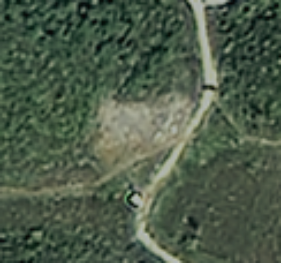</td>
<td>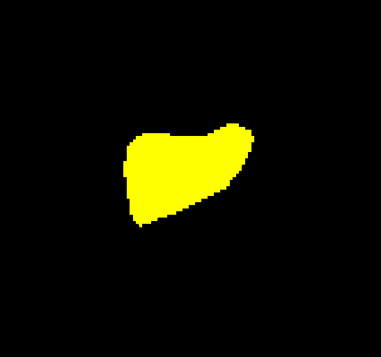</td>
<td></td>
</tr>
</tr>
<td>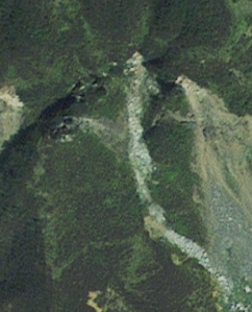</td>
<td>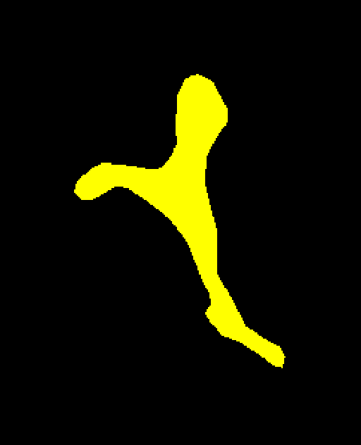</td>
<td></td>
</tr>
<tr>
<td>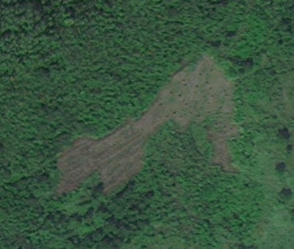</td>
<td>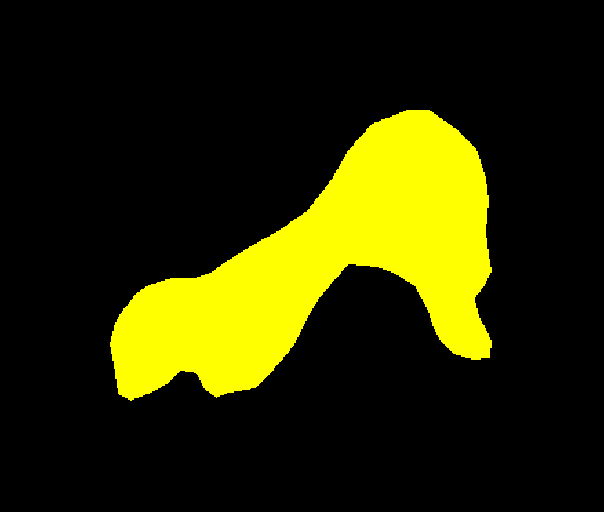</td>
<td>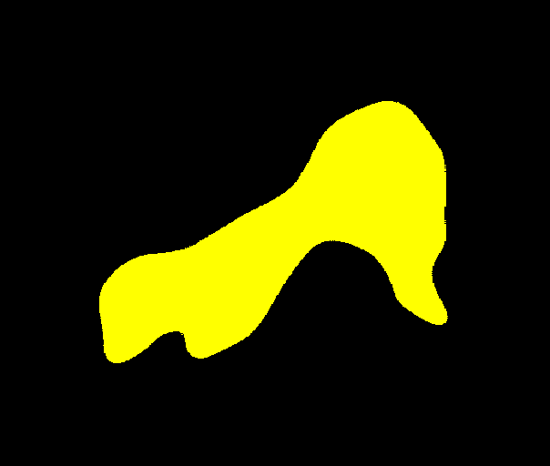</td>
</tr>
</table>

 
<h3>
1 Dataset Citation
</h3>
The dataset used here was derived from   
<a href="https://zenodo.org/records/3775870">
<a href="http://gpcv.whu.edu.cn/data/Bijie_pages.html">
<b>Bijie Landslide Dataset</b>
</a>.
  
We create an open remote sensing landslide dataset called Bijie landslide dataset for developing automatic landslide detection methods. The dataset consists of satellite optical images, shapefiles of landslides’ boundaries and digital elevation models. All the images in this dataset, i.e. 770 landslide images (red points) and 2003 non-landslide images were cropped 
from the TripleSat satellite images captured from May to August 2018.
  
For the landslide instances, we provide the landslide images (*.png), the landslide shapefiles (mask files, *.png), 
the corresponding DEM data (*.png) and each landslide’ boundary coordinates (polygon, *.txt).  
For the non-landslide samples, the images and the corresponding DEM data were provided.  
All the data was prepared with a careful three-fold inspection to ensure its reliability.  
 More details can be found in: 
 Ji, S., Yu, D., Shen, C., Li, W., & Xu, Q. 
<b> Landslide detection from an open satellite imagery and digital elevation model dataset  
  using attention boosted convolutional neural networks. Landslides, 1-16, 2020.</b>
  
<b>License</b> 
Unknown
</a> 
 
<h3>
2 Bijie-Landslide ImageMask Dataset
</h3>
<h4>2.1 Download Bijie-Landslide dataset</h4>
 If you would like to train this Bijie-Landslide Segmentation model by yourself,
 please download the augmented <a href="https://drive.google.com/file/d/1S_y_S2guvvgkH4S1y_XsBvFD_YBX4EbN/view?usp=sharing">
 <b>Augmented-Bijie-Landslide-ImageMask-Dataset.zip</b></a>
on the google drive, expand the downloaded, and put it under dataset folder to be:
<pre>
./dataset
└─Bijie-Landslide
    ├─test
    │  ├─images
    │  └─masks
    ├─train
    │  ├─images
    │  └─masks
    └─valid
        ├─images
        └─masks
</pre>
<b>Bijie-Landslide Statistics</b> 
 
 
As shown above, the number of images of train and valid datasets is not so large to use for a training set of our segmentation model.
   
<h4>2.2 Bijie-Landslide Derivation</h4>
The renamed folder structure of the original dataset is the following.  
<pre>
./Bijie Landslide dataset
├─landslide
│  ├─dem
│  ├─image
│  ├─mask
│  └─polygon_coordinate
└─non-landslide
    ├─dem
    └─image
</pre>
We used the following 2 Python scripts to generate the Upscaled, width and height >=512 pixcels, and Augmented Bijie Landslide dataset from 
 770 files in <b>image</b> and corresponding mask files in <b>mask</b> in <b>landslide</b> folder. 
<ul>
<li><a href="./generator/ImageMaskDatasetGenerator.py">ImageMaskDatasetGenerator.py</a></li>
<li><a href="./generator/split_master.py">split_master.py</a></li>
</ul>
 
<h4>2.3 Train Image and Mask samples </h4>
<b>Train_images_sample</b> 
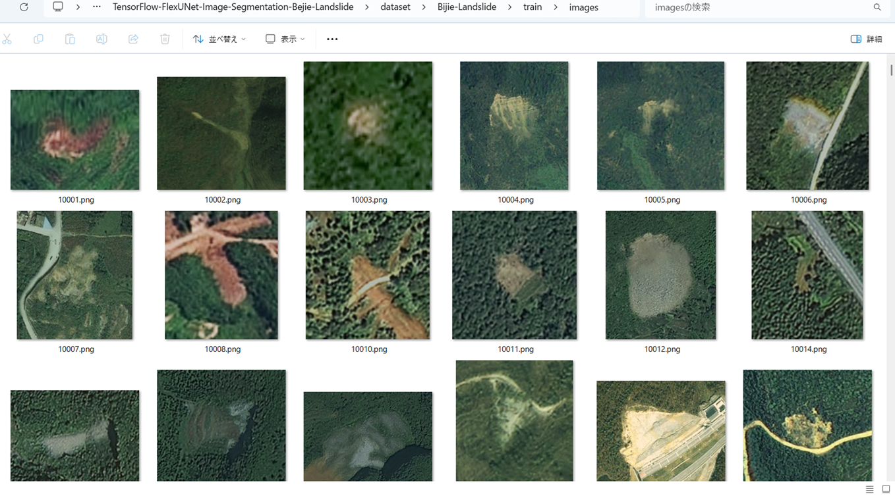
 
<b>Train_masks_sample</b> 
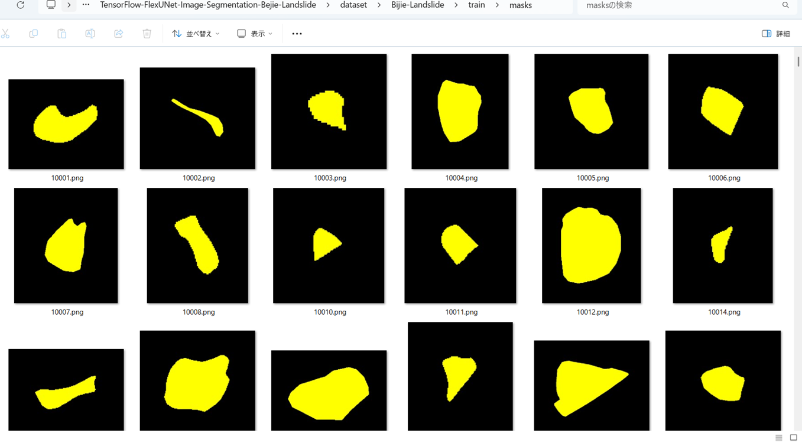
 
 
<h3>
3 Train TensorFlowFlexUNet Model
</h3>
 We trained Bijie-Landslide TensorFlowFlexUNet Model by using the following
<a href="./projects/TensorFlowFlexUNet/Bijie-Landslide/train_eval_infer.config"> <b>train_eval_infer.config</b></a> file.  
Please move to ./projects/TensorFlowFlexUNet/Bijie-Landslide and, and run the following bat file. 
<pre>
>1.train.bat
</pre>
, which simply runs the following command. 
<pre>
>python ../../../src/TensorFlowFlexUNetTrainer.py ./train_eval_infer.config
</pre>

<b>Model parameters</b> 
Defined a small <b>base_filters = 16</b> and a large <b>base_kernels = (11,11)</b> for the first Conv Layer of Encoder Block of 
<a href="./src/TensorFlowFlexUNet.py">TensorFlowFlexUNet.py</a> 
and a large num_layers (including a bridge between Encoder and Decoder Blocks).
<pre>
[model]
image_width    = 512
image_height   = 512
image_channels = 3
input_normalize = True
num_classes    = 2

base_filters   = 16
base_kernels   = (11,11)
num_layers     = 8
dropout_rate   = 0.04
dilation       = (1,1)
</pre>

<b>Learning rate</b> 
Defined a very small learning rate.  
<pre>
[model]
learning_rate  = 0.00007
</pre>

<b>Online augmentation</b> 
Disabled our online augmentation.  
<pre>
[model]
model         = "TensorFlowFlexUNet"
generator     = False
</pre>

<b>Loss and metrics functions</b> 
Specified "categorical_crossentropy" and <a href="./src/dice_coef_multiclass.py">"dice_coef_multiclass"</a>. 
You may specify other loss and metrics function names. 
<pre>
[model]
loss           = "categorical_crossentropy"
metrics        = ["dice_coef_multiclass"]
</pre>
<b>Learning rate reducer callback</b> 
Enabled learing_rate_reducer callback, and a small reducer_patience.
<pre> 
[train]
learning_rate_reducer = True
reducer_factor     = 0.5
reducer_patience   = 4
</pre>

<b>Early stopping callback</b> 
Enabled early stopping callback with patience parameter.
<pre>
[train]
patience      = 10
</pre>

<b>RGB Color map</b> 
rgb color map dict for Bijie-Landslide 1+1 classes.
<pre>
[mask]
mask_datatype    = "categorized"
mask_file_format = ".png"
;                     Landslide: yellow
rgb_map = {(0,0,0):0, (255,255,0):1,}
</pre>

<b>Epoch change inference callback</b> 
Enabled <a href="./src/EpochChangeInferencer.py">epoch_change_infer callback (EpochChangeInferencer.py)</a></b>. 
<pre>
[train]
poch_change_infer     = True
epoch_change_infer_dir =  "./epoch_change_infer"
epoch_change_tiled_infer     = False
epoch_change_tiled_infer_dir =  "./epoch_change_tiled_infer"
</pre>

By using this callback, on every epoch_change, the inference procedure can be called
 for 6 images in <b>mini_test</b> folder. This will help you confirm how the predicted mask changes 
 at each epoch during your training process.    

<b>Epoch_change_inference output at starting (epoch 1,2,3)</b> 
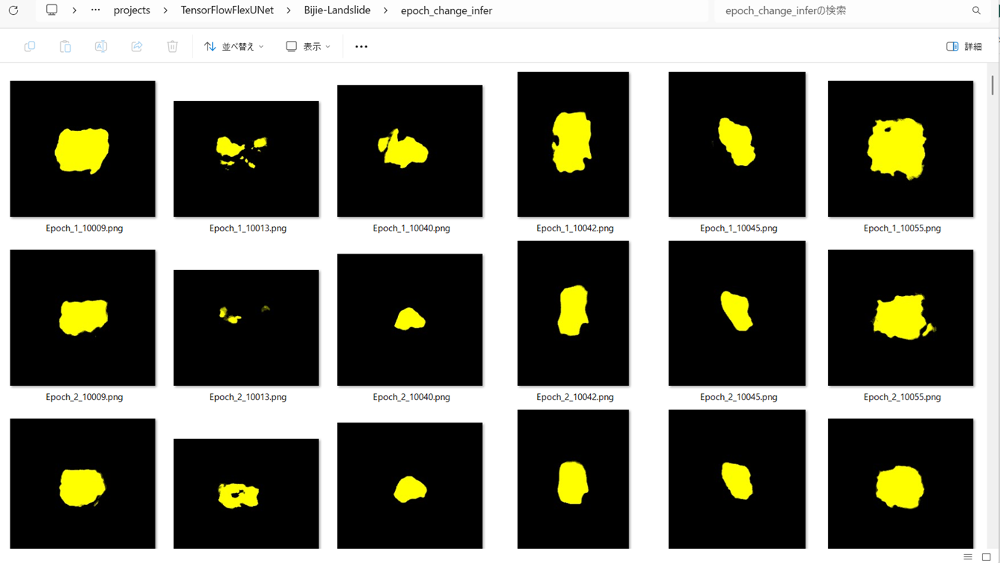 
 
<b>Epoch_change_inference output at middlepoint (epoch 31,32,33)</b> 
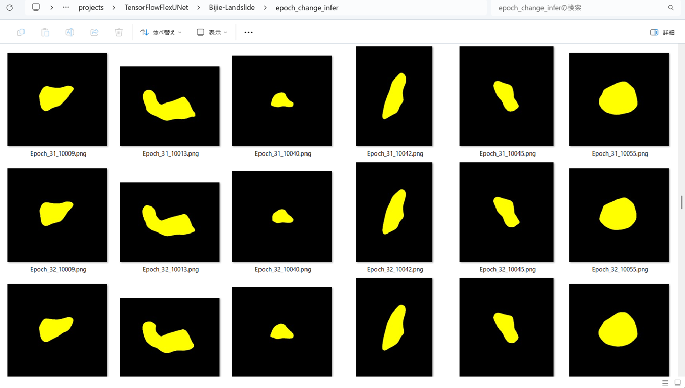 
 
<b>Epoch_change_inference output at ending (epoch 64,65,66)</b> 
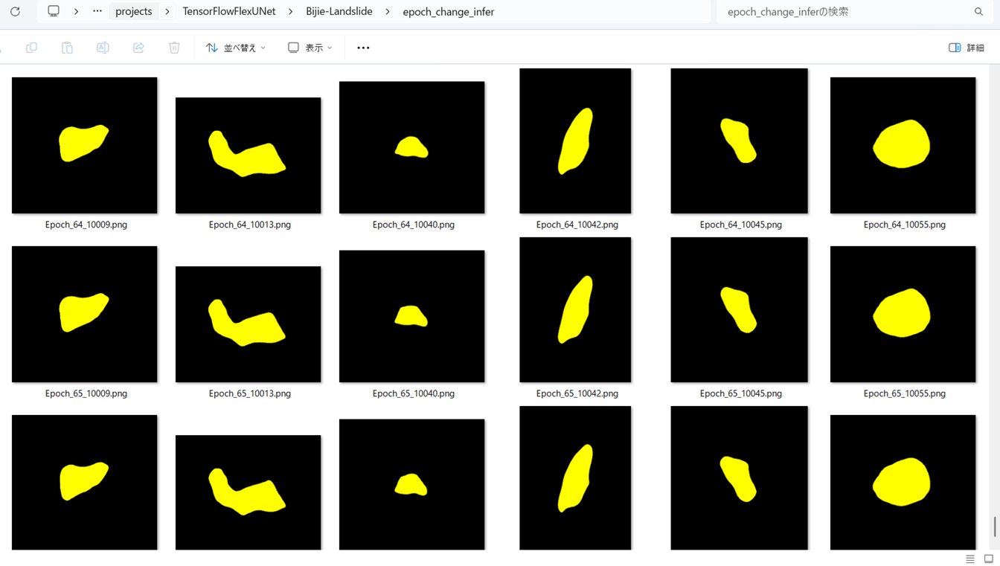 
 

In this experiment, the training process was stopped at epoch 66 by EarlyStoppingCallback.  
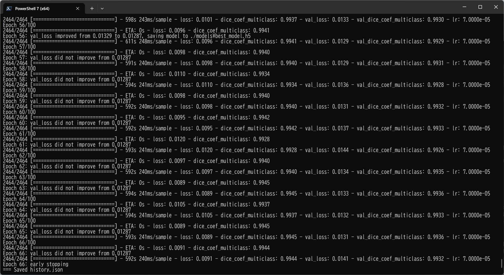 
 
<a href="./projects/TensorFlowFlexUNet/Bijie-Landslide/eval/train_metrics.csv">train_metrics.csv</a> 
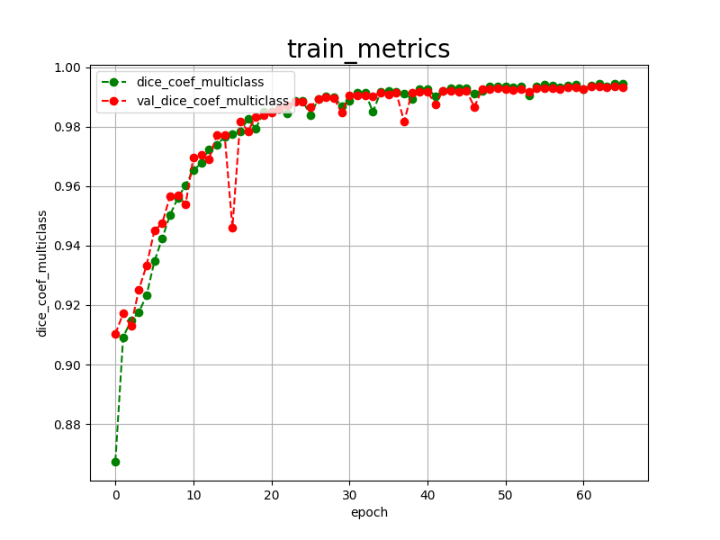 
 
<a href="./projects/TensorFlowFlexUNet/Bijie-Landslide/eval/train_losses.csv">train_losses.csv</a> 
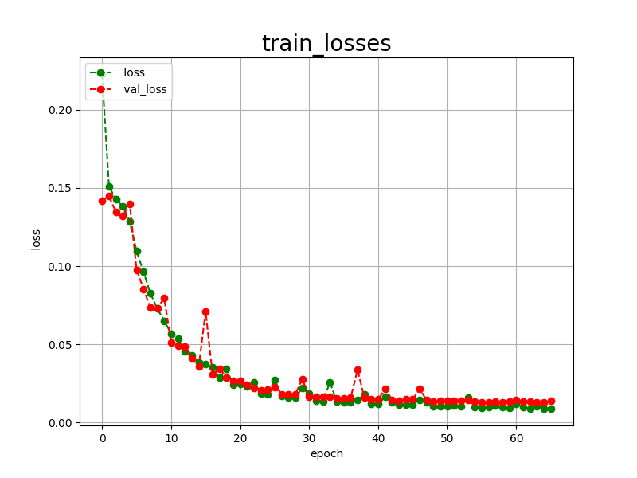 
 
<h3>
4 Evaluation
</h3>
Please move to <b>./projects/TensorFlowFlexUNet/Bijie-Landslide</b> folder, 
and run the following bat file to evaluate TensorFlowUNet model for Bijie-Landslide. 
<pre>
./2.evaluate.bat
</pre>
This bat file simply runs the following command.
<pre>
python ../../../src/TensorFlowFlexUNetEvaluator.py ./train_eval_infer.config
</pre>

Evaluation console output: 

  Bijie-Landslide
<a href="./projects/TensorFlowFlexUNet/Bijie-Landslide/evaluation.csv">evaluation.csv</a> 
The loss (categorical_crossentropy) to this Bijie-Landslide/test was low, and dice_coef_multiclass very high as shown below.
 
<pre>
categorical_crossentropy,0.0129
dice_coef_multiclass,0.9928
</pre>
 
<h3>
5 Inference
</h3>
Please move to <b>./projects/TensorFlowFlexUNet/Bijie-Landslide</b> folder 
,and run the following bat file to infer segmentation regions for images by the Trained-TensorFlowFlexUNet model for Bijie-Landslide. 
<pre>
./3.infer.bat
</pre>
This simply runs the following command.
<pre>
python ../../../src/TensorFlowFlexUNetInferencer.py ./train_eval_infer.config
</pre>

<b>mini_test_images</b> 
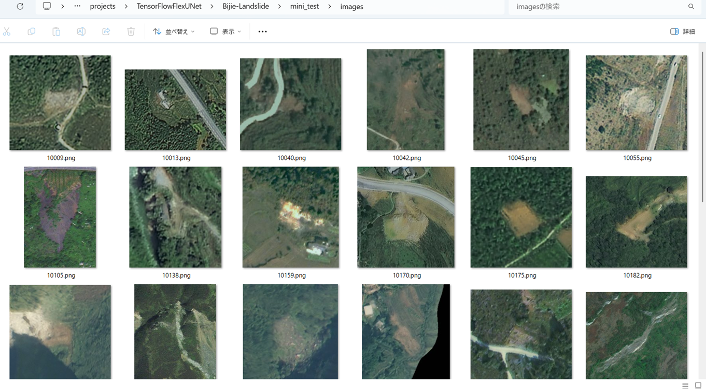 
<b>mini_test_mask(ground_truth)</b> 
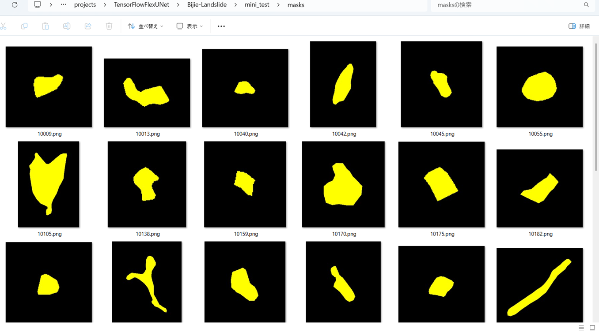 

<b>Inferred test masks</b> 
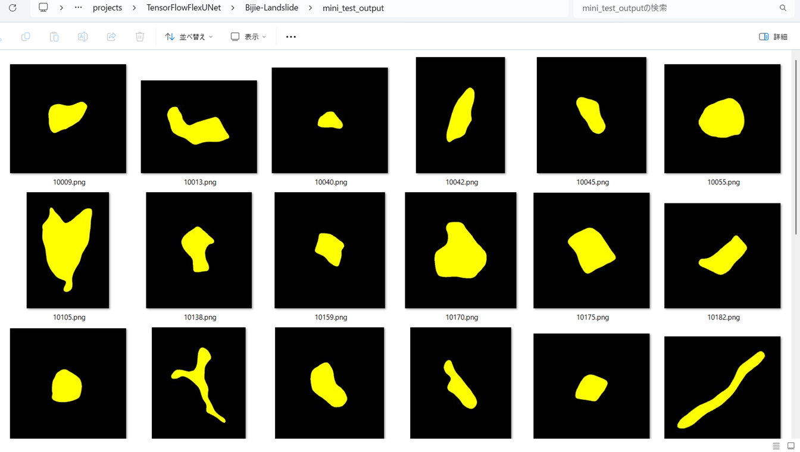 
 

<b>Enlarged images and masks for the Upscaled Bijie-Landslide Images</b> 
As shown below, the inferred masks predicted by our segmentation model trained on the 
augmented dataset appear similar to the ground truth masks. 
<table>
<tr>
<th>Input: image</th>
<th>Mask (ground_truth)</th>
<th>Prediction: inferred_mask</th>
</tr>
<td>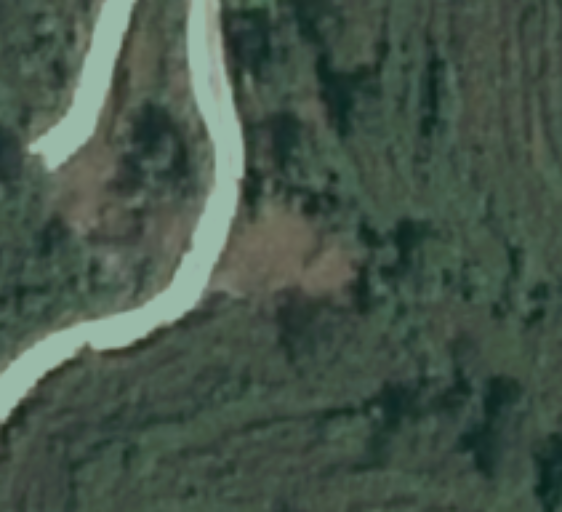</td>
<td></td>
<td>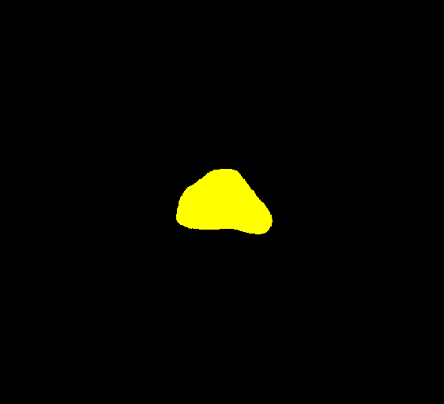</td>
</tr>
<tr>
<td>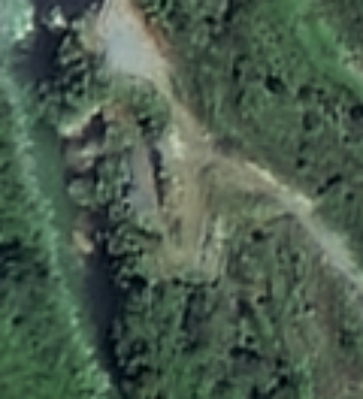</td>
<td>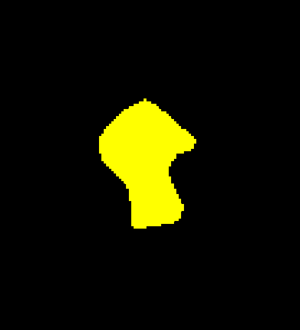</td>
<td>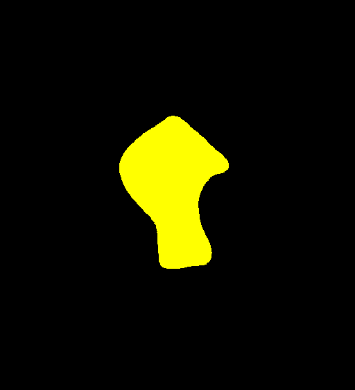</td>
</tr>
<tr>
<td>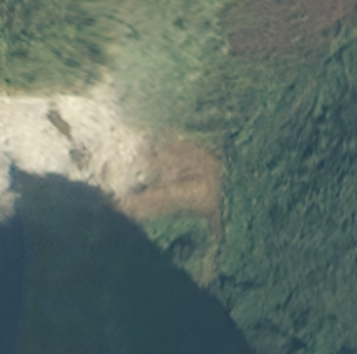</td>
<td>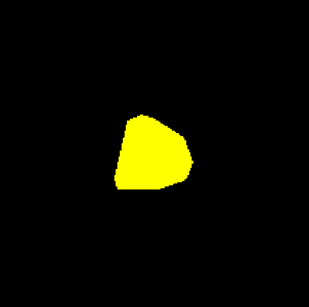</td>
<td>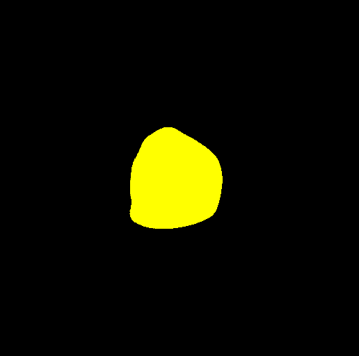</td>
</tr>
<tr>
<td>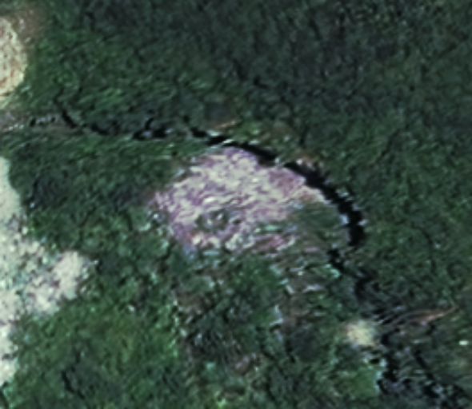</td>
<td>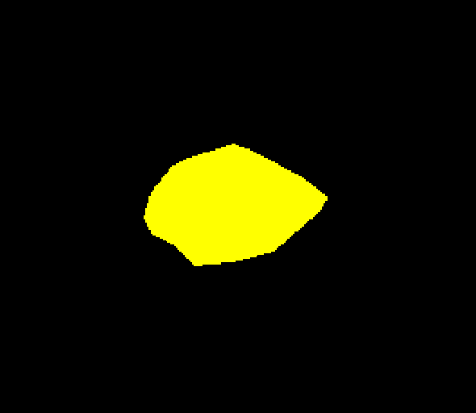</td>
<td>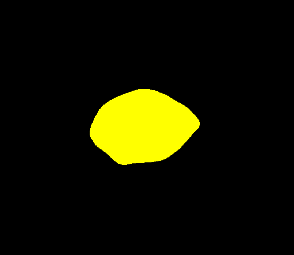</td>
</tr>
<tr>
<td>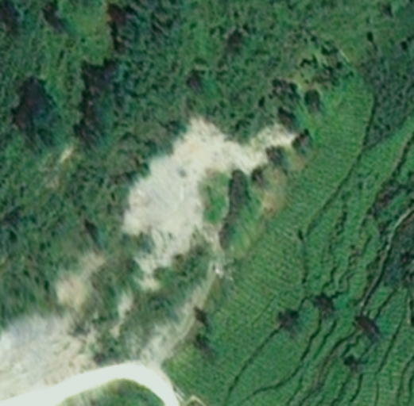</td>
<td>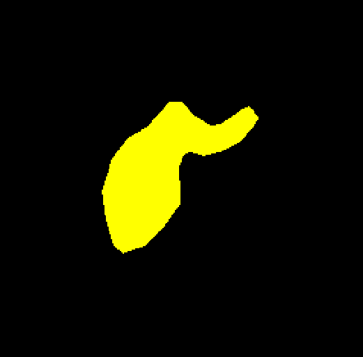</td>
<td>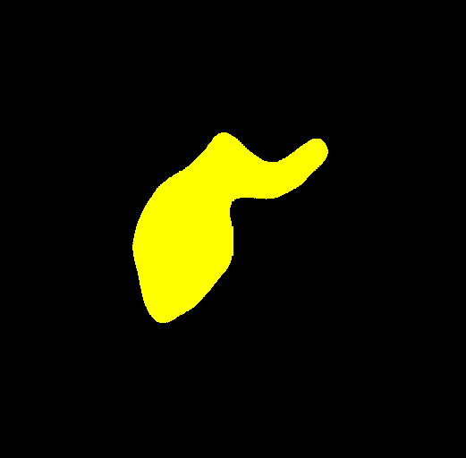</td>
</tr>
<tr>
<td>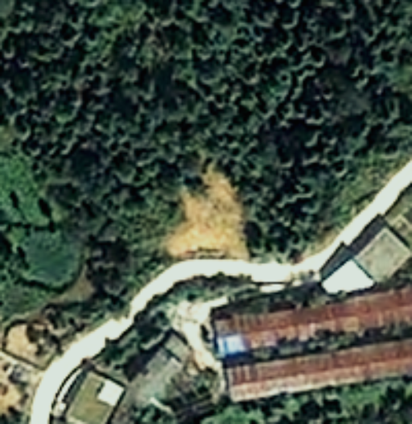</td>
<td>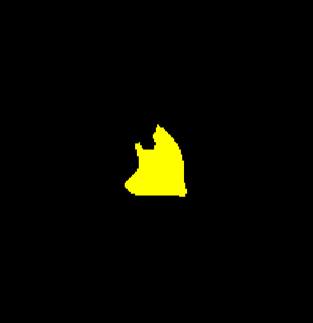</td>
<td>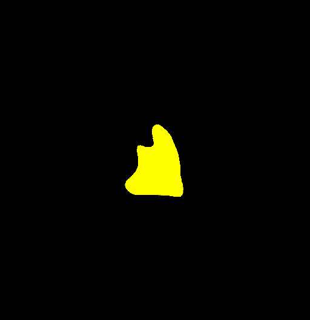</td>
</tr>
</table>

 
<h3>
References
</h3>
<b>1. Landslide detection from an open satellite imagery
and digital elevation model dataset using attention  
boosted convolutional neural networks</b> 
Shunping Ji, Dawen Yu, Chaoyong Shen, Weile Li, Qiang Xu 
<a href="https://sci-hub.ru/10.1007/s10346-020-01353-2">https://sci-hub.ru/10.1007/s10346-020-01353-2</a>
 
 
<b>2. TensorFlow-FlexUNet-Image-Segmentation-Model</b> 
Toshiyuki Arai antillia.com  
<a href="https://github.com/sarah-antillia/TensorFlow-FlexUNet-Image-Segmentation-Model">
https://github.com/sarah-antillia/TensorFlow-FlexUNet-Image-Segmentation-Model
</a>
 
 
<b>3. TensorFlow-FlexUNet-Image-Segmentation-Landslide4Sense</b> 
Toshiyuki Arai antillia.com  
<a href="https://github.com/atlan-antillia/TensorFlow-FlexUNet-Image-Segmentation-Landslide4Sense">
https://github.com/atlan-antillia/TensorFlow-FlexUNet-Image-Segmentation-Landslide4Sense
</a>
 
 
<b>4. TensorFlow-FlexUNet-Image-Segmentation-Japan-Landslide</b> 
Toshiyuki Arai antillia.com  
<a href="https://github.com/atlan-antillia/TensorFlow-FlexUNet-Image-Segmentation-Japan-Landslide">
https://github.com/atlan-antillia/TensorFlow-FlexUNet-Image-Segmentation-Japan-Landslide
</a>
 
 
<b>5. TensorFlow-FlexUNet-Tiled-Image-Segmentation-Sichuan-Landslide</b> 
Toshiyuki Arai antillia.com  
<a href="https://github.com/atlan-antillia/TensorFlow-FlexUNet-Tiled-Image-Segmentation-Sichuan-Landslide">
https://github.com/atlan-antillia/TensorFlow-FlexUNet-Tiled-Image-Segmentation-Sichuan-Landslide
</a>

